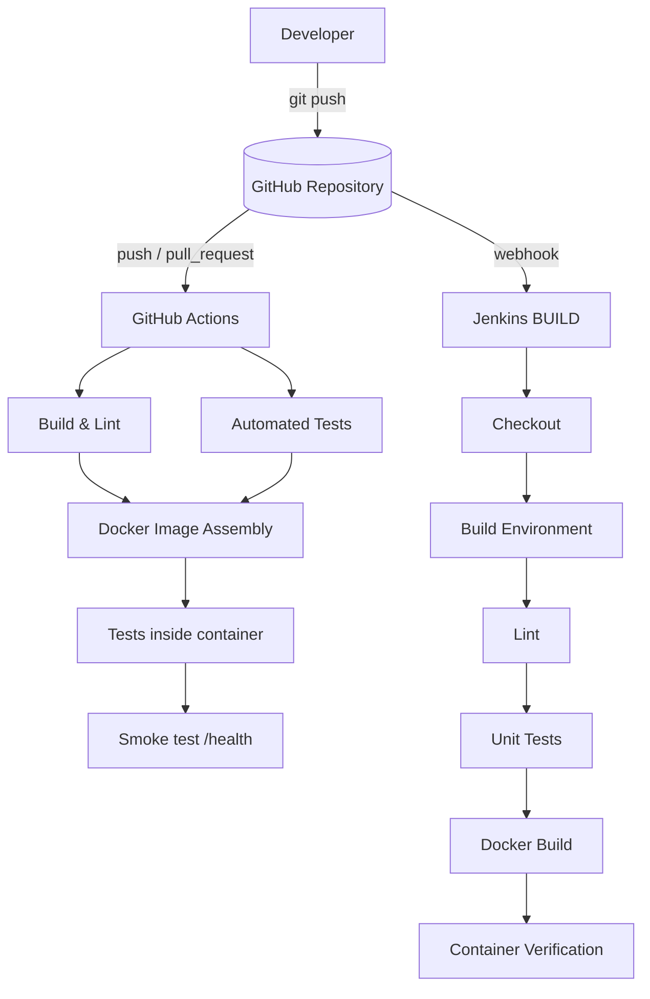

# ACEest Fitness &amp; Gym

A Flask web application for gym and fitness management, delivered with a complete
automated CI/CD pipeline built on **Git**, **GitHub Actions**, **Docker** and **Jenkins**.

> **Assignment:** Introduction to DevOps — Implementing Automated CI/CD Pipelines
> for ACEest Fitness &amp; Gym (CSIZG514/SEZG514).

---

## Table of Contents

- [Overview](#overview)
- [Architecture](#architecture)
- [Tech Stack](#tech-stack)
- [Project Structure](#project-structure)
- [Local Setup &amp; Execution](#local-setup--execution)
- [Running the Tests Manually](#running-the-tests-manually)
- [Docker](#docker)
- [CI/CD Integration Logic](#cicd-integration-logic)
  - [GitHub Actions](#github-actions)
  - [Jenkins](#jenkins)
- [API Reference](#api-reference)
- [Evaluation Checklist](#evaluation-checklist)

---

## Overview

The application manages gym clients, workout logging and weekly adherence tracking.
Business rules (BMI, BMR, calorie targets, membership status, adherence scoring) are
isolated in a pure `logic` module so they can be unit tested without Flask or a database.

**Current test status:** 74 tests passing, **94%** statement coverage, flake8 clean.

---

## Architecture



Both pipelines are **independent quality gates**: GitHub Actions validates every
change quickly, while Jenkins performs the authoritative clean build.

---

## Tech Stack

| Layer | Technology |
|---|---|
| Language | Python 3.12 |
| Web Framework | Flask 3.0.3 |
| Database | SQLite 3 |
| Testing | Pytest 8.3.2 + pytest-cov |
| Linting | flake8 7.1.0 |
| Containerisation | Docker (multi-stage build) |
| CI/CD | GitHub Actions, Jenkins |

---

## Project Structure

```text
aceest-fitness/
├── aceest/
│   ├── __init__.py        # Application factory, error handlers, /health
│   ├── db.py              # SQLite connection handling, schema & seed data
│   ├── logic.py           # Pure business logic (BMI, BMR, validation, ...)
│   ├── clients.py         # Client + program blueprint
│   └── workouts.py        # Workout + progress blueprint
├── tests/
│   ├── conftest.py        # Shared fixtures (tmp DB per test)
│   ├── test_logic.py      # Unit tests for pure logic
│   └── test_api.py        # Integration tests for HTTP endpoints
├── .github/workflows/
│   └── main.yml           # GitHub Actions CI pipeline
├── Dockerfile             # Multi-stage, non-root production image
├── .dockerignore
├── Jenkinsfile            # Jenkins BUILD & quality gate
├── requirements.txt
├── pyproject.toml
├── .flake8
├── .gitignore
├── app.py                 # WSGI entry point
└── README.md
```

---

## Local Setup &amp; Execution

### Prerequisites

- Python 3.10 or newer
- (Optional) Docker Desktop

### 1. Clone the repository

```bash
git clone https://github.com/<your-username>/aceest-fitness.git
cd aceest-fitness
```

### 2. Create a virtual environment

**Windows (PowerShell)**

```powershell
python -m venv .venv
.venv\Scripts\Activate.ps1
```

**macOS / Linux**

```bash
python3 -m venv .venv
source .venv/bin/activate
```

### 3. Install dependencies

```bash
pip install -r requirements.txt
```

### 4. Run the application

```bash
python app.py
```

The API is now available at **http://localhost:5000**.

```bash
# Windows PowerShell
curl http://localhost:5000/health
curl http://localhost:5000/api/clients

# macOS / Linux
curl http://localhost:5000/health
curl http://localhost:5000/api/clients
```

The SQLite database is created automatically in `instance/aceest_fitness.db` on
first run and is seeded with sample clients, workouts and progress records.

To reset the database, delete the file and restart:

```bash
rm -f instance/aceest_fitness.db
```

---

## Running the Tests Manually

### Full suite with coverage

```bash
pytest -v --cov=aceest --cov-report=term-missing
```

Expected output:

```text
........................................................................ [ 97%]
..                                                                       [100%]
TOTAL                  299     19    94%
```

### Run a single test file

```bash
pytest tests/test_logic.py -v
```

### Run a single test case

```bash
pytest tests/test_logic.py::TestBMI::test_calculate_bmi_known_value -v
```

### Run with HTML coverage report

```bash
pytest --cov=aceest --cov-report=html
# Open htmlcov/index.html in your browser
```

### Lint the codebase

```bash
flake8 .
```

### Using `pytest` inside a virtual environment

If you have not activated the environment, prefix with the interpreter directly:

```bash
python -m pytest -q
```

---

## Docker

### Build the image

```bash
docker build -t aceest-fitness:1.0.0 .
```

### Run the container

```bash
docker run -d --name aceest -p 5000:5000 aceest-fitness:1.0.0
```

### Verify

```bash
curl http://localhost:5000/health
docker ps
docker logs aceest
```

### Persist data across restarts

```bash
docker run -d --name aceest -p 5000:5000 \
  -v aceest-data:/data aceest-fitness:1.0.0
```

### Run the test suite inside the image

```bash
docker run --rm -v "$(pwd)/tests:/app/tests:ro" aceest-fitness:1.0.0 \
  sh -c "pip install --no-cache-dir pytest pytest-cov >/dev/null 2>&1 && python -m pytest -q /app/tests"
```

### Dockerfile highlights

- **Multi-stage build** — dependencies are installed in a builder stage and only
  the virtualenv is copied forward, keeping the final image small.
- **Non-root user** — the app runs as the unprivileged `aceest` user.
- **No build tools in the runtime layer** — compilers are never carried into production.
- **HEALTHCHECK** — a polling probe against `/health` with retry logic.
- **Pinned base image** — `python:3.12-slim` for reproducible builds.

---

## CI/CD Integration Logic

### GitHub Actions

**File:** `.github/workflows/main.yml`
**Triggers:** every `push` and every `pull_request` (all branches).

Three jobs run in sequence, exactly as required by the assignment:

| Job | Purpose | Key steps |
|---|---|---|
| `build` | **Build &amp; Lint** | Checkout → install deps → `flake8 .` → `compileall` syntax check |
| `test` | **Automated Testing** | Checkout → install deps → `pytest` with coverage → upload `coverage.xml` |
| `docker` | **Docker Image Assembly** | Depends on `build` + `test` → Buildx build → run pytest inside container → smoke test `/health` |

Notes:

- `docker` has `needs: [build, test]`, so the image is only assembled once linting
  and unit tests have both passed — this is the pipeline's **quality gate**.
- Buildx layer caching (`cache-from`/`cache-to` `type=gha`) keeps rebuilds fast.
- `concurrency` cancels superseded runs on the same branch to save runner minutes.
- The coverage XML is uploaded as an artifact on every run, even on failure.

### Jenkins

**File:** `Jenkinsfile`
**Purpose:** the authoritative **BUILD** and secondary validation layer.

Stages:

1. **Checkout** — pulls the latest commit from GitHub.
2. **Build Environment** — creates a *clean* `.venv` and installs `requirements.txt`.
3. **Lint** — runs `flake8` with statistics.
4. **Unit Tests** — runs `pytest` with coverage; a failure stops the build.
5. **Docker Build** — tags the image with `$BUILD_NUMBER`.
6. **Container Verification** — executes the test suite inside the freshly built image.

Declarative pipeline features used:

- `buildDiscarder` — keeps only the last 10 builds.
- `timeout` — hard-stops builds after 30 minutes.
- `disableConcurrentBuilds` — avoids overlapping builds on one branch.
- `timestamps()` — console timestamps for traceability.
- `cleanWs()` in `post { always }` — no workspace contamination between builds.

---

## API Reference

| Method | Endpoint | Description |
|---|---|---|
| `GET` | `/health` | Liveness probe |
| `GET` | `/api/clients` | List all clients with derived metrics |
| `POST` | `/api/clients` | Create a client |
| `GET` | `/api/clients/<name>` | Client detail with workouts and progress |
| `DELETE` | `/api/clients/<name>` | Delete a client and dependent records |
| `GET` | `/api/clients/programs/list` | List training programs |
| `GET` | `/api/clients/programs/<name>` | Program workout and diet plan |
| `GET` | `/api/workouts` | List workouts (`?client_name=` to filter) |
| `POST` | `/api/workouts` | Log a workout |
| `GET` | `/api/progress/<client_name>` | Adherence history and average |
| `POST` | `/api/progress` | Record weekly adherence |

### Example — create a client

```bash
curl -X POST http://localhost:5000/api/clients \
  -H "Content-Type: application/json" \
  -d '{"name": "Kiran Rao", "age": 31, "height": 175, "weight": 72}'
```

### Example — log a workout

```bash
curl -X POST http://localhost:5000/api/workouts \
  -H "Content-Type: application/json" \
  -d '{
        "client_name": "Arjun Mehta",
        "date": "2026-10-01",
        "workout_type": "Strength",
        "duration_min": 50,
        "notes": "Deadlifts"
      }'
```

---

## Evaluation Checklist

| Criterion | Where it is satisfied |
|---|---|
| **Application Integrity** | Flask app with 11 endpoints, validated input, derived health metrics |
| **VCS Maturity** | `.gitignore` in place, atomic commits, feature/infrastructure branching |
| **Testing Coverage** | 74 tests, 94% coverage, unit + integration split |
| **Docker Efficiency** | Multi-stage build, non-root user, no build tools, layer caching, `.dockerignore` |
| **Pipeline Reliability** | GitHub Actions (3 stages) + Jenkins (6 stages), both fail-fast with clear logs |

---

## License

Released for academic use as part of the DevOps assignment coursework.